# People Analytics - Predição de Turnover

**Português** | [English](README.en.md)


[](https://app.powerbi.com/view?r=eyJrIjoiNzg1MmZhNjctMTI0Ny00ZDIxLWFlMjItZTZiMDRhZjFlZWUwIiwidCI6IjI4NDVhN2ExLWQ3ZTMtNDBjNC1hMGYwLWY4NWI5OWY2Mjc2YyJ9)

Projeto completo de People Analytics que combina engenharia de dados, machine learning e visualização em Power BI para prever e analisar o turnover de colaboradores.

## Sumário

- [Sobre o Projeto](#sobre-o-projeto)
- [Estrutura](#estrutura)
- [Pipeline de Dados](#pipeline-de-dados)
- [Modelo de Machine Learning](#modelo-de-machine-learning)
  - [Comparação de Modelos](#comparação-de-modelos-cross-validation-5-fold)
  - [Metodologia de Validação](#metodologia-de-validação)
  - [Limitações Conhecidas](#limitações-conhecidas)
  - [Top 10 Fatores de Saída](#top-10-fatores-de-saída)
  - [Distribuição do Risco](#distribuição-do-risco)
- [Dashboard Power BI](#dashboard-power-bi)
  - [Medidas DAX](#medidas-dax)
- [Como Executar](#como-executar)
- [Requisitos](#requisitos)
- [Resultados Chave](#resultados-chave)
- [Dicionário de Dados](docs/dicionario_dados.md)
- [Licença](#licença)

## Sobre o Projeto

- Dataset: IBM HR Analytics Employee Attrition (1.470 colaboradores, 35 variáveis originais)
- Após limpeza e feature engineering: 52 colunas (ver `docs/dicionario_dados.md`)
- Objetivo: identificar colaboradores em risco de saída e os fatores que mais contribuem
- Stack: Python (pandas, scikit-learn, XGBoost, SHAP) + Power BI

## Estrutura

```
dados/
    raw/                          CSV original (fonte de verdade)
    processed/                    Dados limpos, scoring ML e tabelas de apoio
scripts/
    pipeline_limpeza_hr.py        ETL: limpeza, downcasting, tradução PT
    pipeline_ml_optimizado.py     ML: 5 modelos + SMOTE + Optuna + scoring
    gerar_graficos.py             Visualizações para documentação
docs/
    dicionario_dados.md           Descrição de cada coluna
    imagens/                      Gráficos do modelo
    imagens/dashboard/            Prints das páginas do dashboard
models/
    modelo_attrition_optimizado.pkl
templates/                        Geradores de background SVG das páginas (HTML)
dashboards/
    People_Analytics_HR_Attrition.pbip
    *.Report/                     Relatório com 4 páginas
    *.SemanticModel/              Modelo: tabela processed + tabelas ML
requirements.txt                  Dependências do projeto
requirements-lock.txt             Versões fixas (reprodutibilidade)
```

## Pipeline de Dados

O pipeline de limpeza transforma o CSV bruto num dataset otimizado:

- Remove 4 colunas sem valor (variância zero + ID)
- Downcasting de tipos (511 KB -> 94 KB, redução de 82%)
- Traduz colunas e valores categóricos para português
- Cria faixas pré-calculadas (etária, salarial, distância, antiguidade)
- Cria labels ordinais ordenadas para gráficos
- Aplica log1p em MonthlyIncome (skewness 1.37 -> 0.29)
- Zero linhas removidas (outliers preservados por relevância de negócio)

## Modelo de Machine Learning

### Comparação de Modelos (Cross-Validation 5-fold)

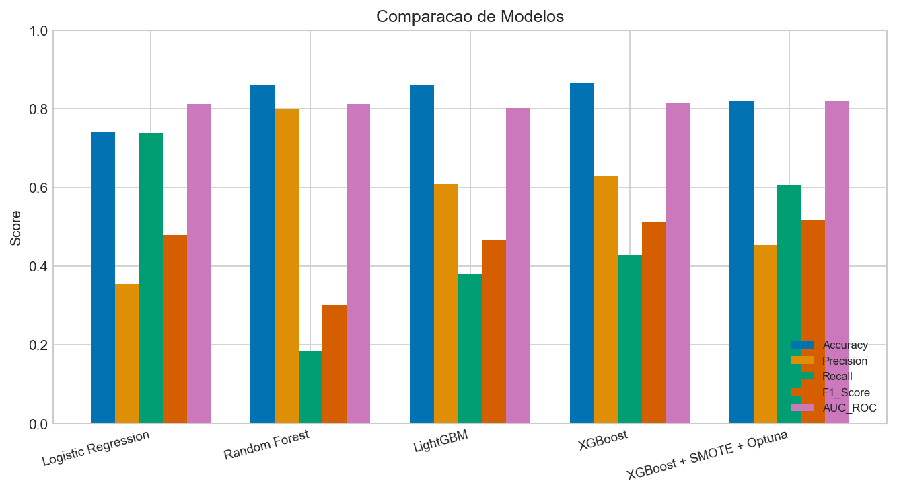

| Modelo | AUC-ROC | Recall | F1 | Precision | Accuracy |
|--------|---------|--------|-----|-----------|----------|
| Logistic Regression | 0.812 | 73.8% | 0.479 | 35.4% | 74.1% |
| Random Forest | 0.813 | 18.6% | 0.301 | 80.0% | 86.1% |
| LightGBM | 0.803 | 38.0% | 0.468 | 60.8% | 86.1% |
| XGBoost | 0.814 | 43.0% | 0.511 | 63.0% | 86.7% |
| XGBoost + SMOTE + Optuna | 0.819 | 60.8% | 0.519 | 45.3% | 81.8% |

Modelo escolhido: **XGBoost + SMOTE + Optuna** (melhor AUC-ROC e melhor F1, com recall elevado).
Em People Analytics, detectar quem vai sair é mais importante que evitar falsos alarmes,
por isso priorizamos recall sem abdicar de uma boa AUC.

### Metodologia de Validação

- **Cross-validation 5-fold estratificado**: todas as métricas reportadas são out-of-fold
  (cada linha é prevista quando está fora do treino), não in-sample.
- **SMOTE dentro do pipeline de CV** (`ImbPipeline`): o oversampling só vê os dados de
  treino de cada fold, evitando vazamento de dados sintéticos para o teste.
- **Baselines com `class_weight="balanced"`** para comparação justa contra o modelo final.
- **Optuna**: 80 trials maximizando AUC-ROC para tuning dos hiperparâmetros do XGBoost.

### Limitações Conhecidas

- **Ganho de AUC modesto**: o modelo otimizado (0.819) supera o XGBoost baseline (0.814)
  por uma margem dentro do ruído. O ganho real está no recall (43% -> 61%), efeito do
  SMOTE + `scale_pos_weight`, não de um modelo fundamentalmente superior.
- **Precision de 45%**: menos de metade dos sinalizados como alto risco sai de fato.
  Aceitável pela lógica de negócio (falso alarme custa pouco), mas deve ser comunicado.
- **Scoring por colaborador é in-sample**: o `RiscoSaida_Prob` que alimenta o dashboard
  vem do modelo treinado no dataset completo, logo é otimista. As métricas honestas (CV)
  estão reportadas à parte na tabela acima.
- **Amostra pequena**: 237 saídas em 1.470 registros; as métricas têm variância relevante.
- **Encoding**: variáveis categóricas nominais usam LabelEncoder (ordem artificial);
  árvores toleram, mas encoding dedicado seria mais limpo.

### Matriz de Confusão

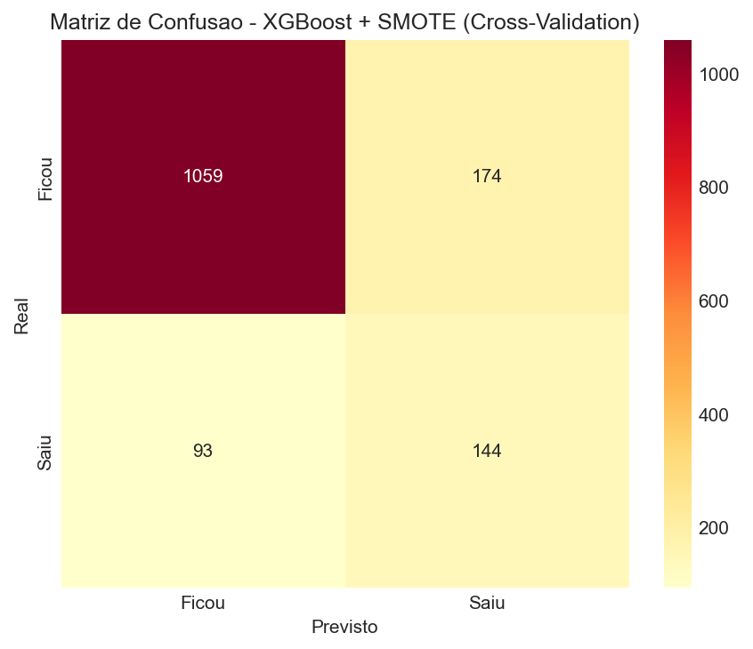

### Curva ROC

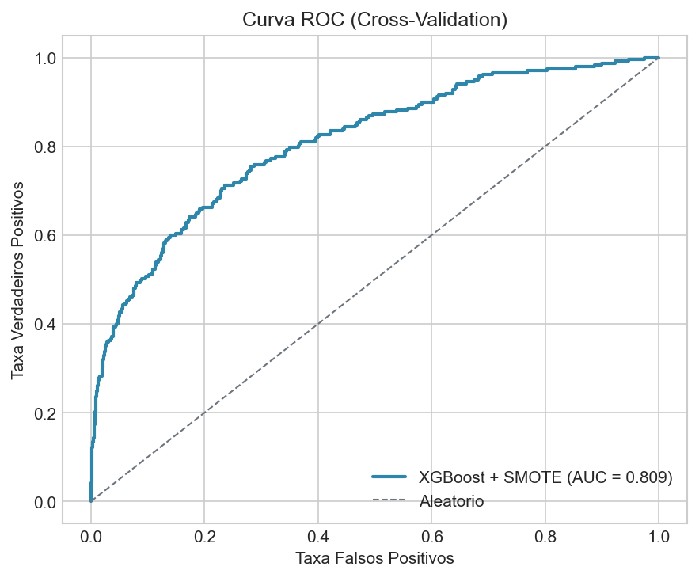

### Top 10 Fatores de Saída

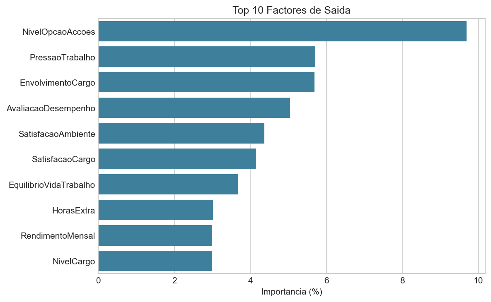

Principais drivers de turnover (importância do modelo):
1. Nível de stock options (quem não tem, sai mais) - 9.7%
2. Pressão de trabalho (horas extra + mau equilíbrio) - 5.7%
3. Envolvimento com o cargo - 5.7%
4. Avaliação de desempenho - 5.0%
5. Satisfação com o ambiente - 4.4%

### SHAP - Explicabilidade

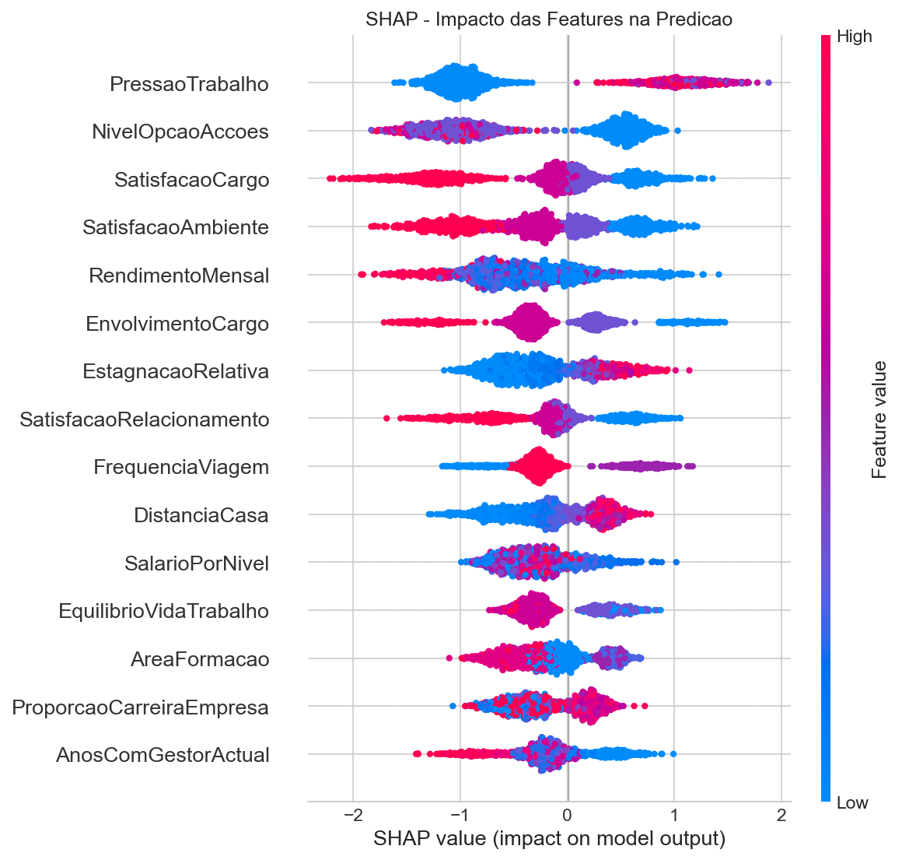

### Distribuição do Risco

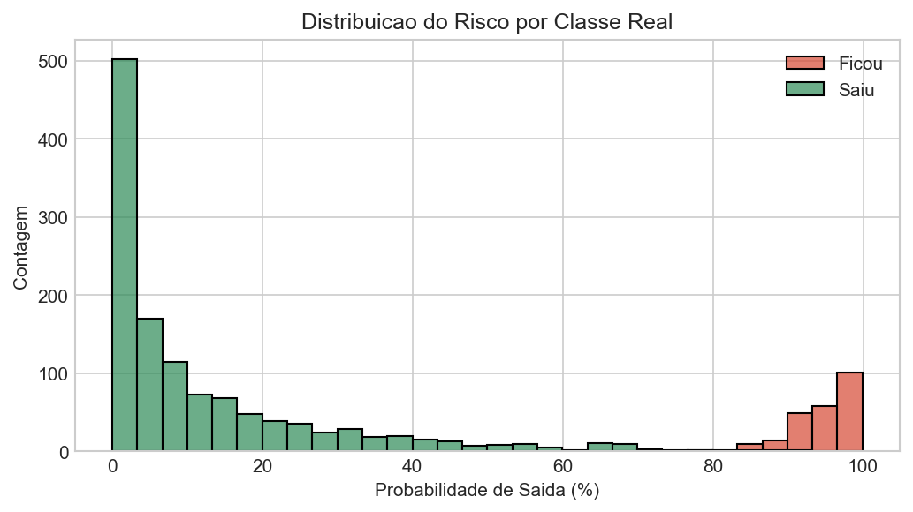

O scoring classifica cada colaborador em 3 níveis, por thresholds fixos de negócio
sobre a probabilidade de saída:

| Classe | Regra | Colaboradores |
|--------|-------|---------------|
| Alto | probabilidade >= 40% | 312 |
| Médio | probabilidade 20-40% | 155 |
| Baixo | probabilidade < 20% | 1.003 |

### Turnover por Departamento

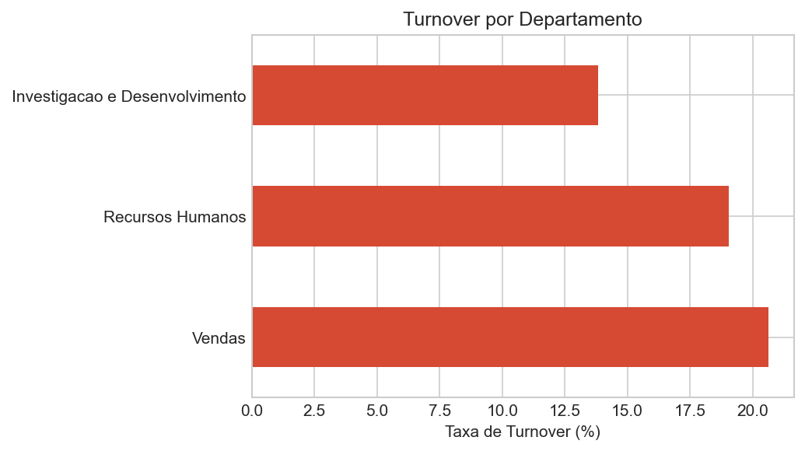

## Dashboard Power BI

> **[Acesse o dashboard online](https://app.powerbi.com/view?r=eyJrIjoiNzg1MmZhNjctMTI0Ny00ZDIxLWFlMjItZTZiMDRhZjFlZWUwIiwidCI6IjI4NDVhN2ExLWQ3ZTMtNDBjNC1hMGYwLWY4NWI5OWY2Mjc2YyJ9)** (Power BI Service)

O relatório está organizado em 4 páginas, todas com fundo SVG próprio
(gerado pelos templates em `templates/`) e segmentadores de Departamento,
Gênero e Horas Extra:

### Página Inicial

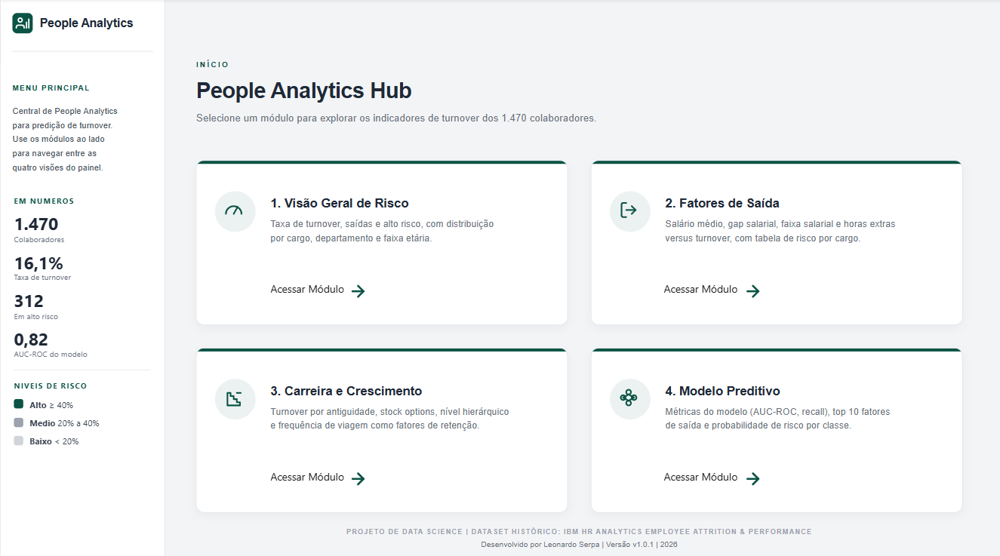

### 1. Visão Geral de Risco

Taxa de turnover, saídas e colaboradores em alto risco, com distribuição
por cargo, departamento e faixa etária.

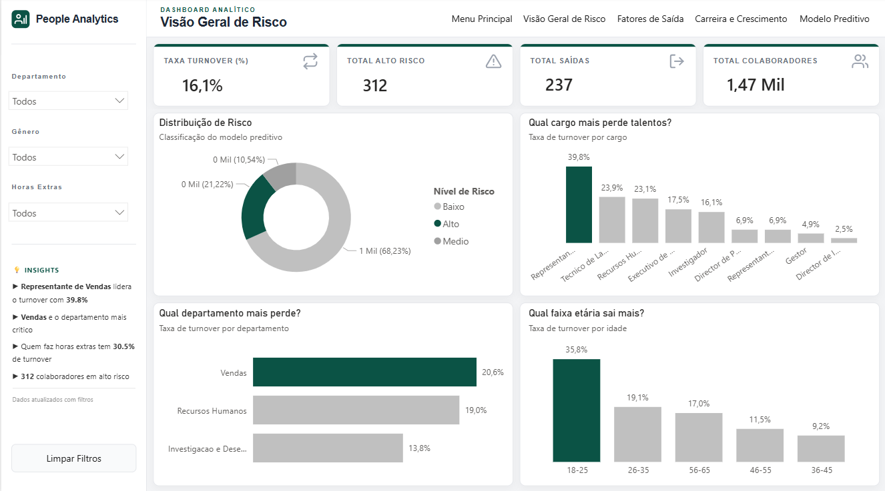

### 2. Fatores de Saída

Salário médio, gap salarial, faixa salarial e horas extras versus turnover,
com tabela de risco por cargo e departamento.

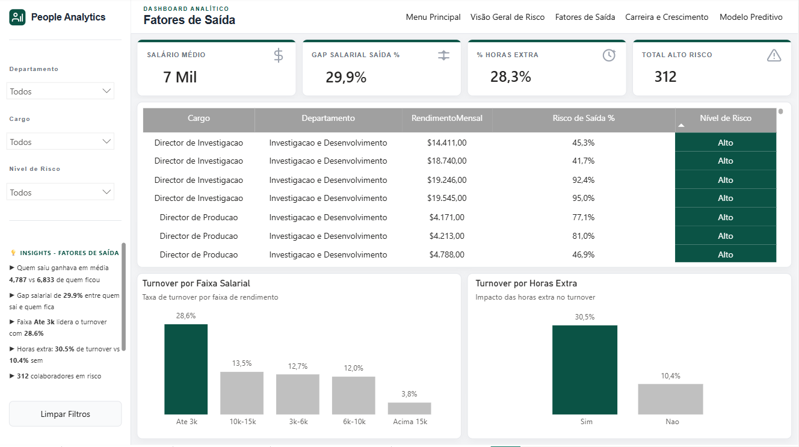

### 3. Carreira e Crescimento

Turnover por antiguidade, stock options, nível hierárquico e frequência
de viagem como fatores de retenção.

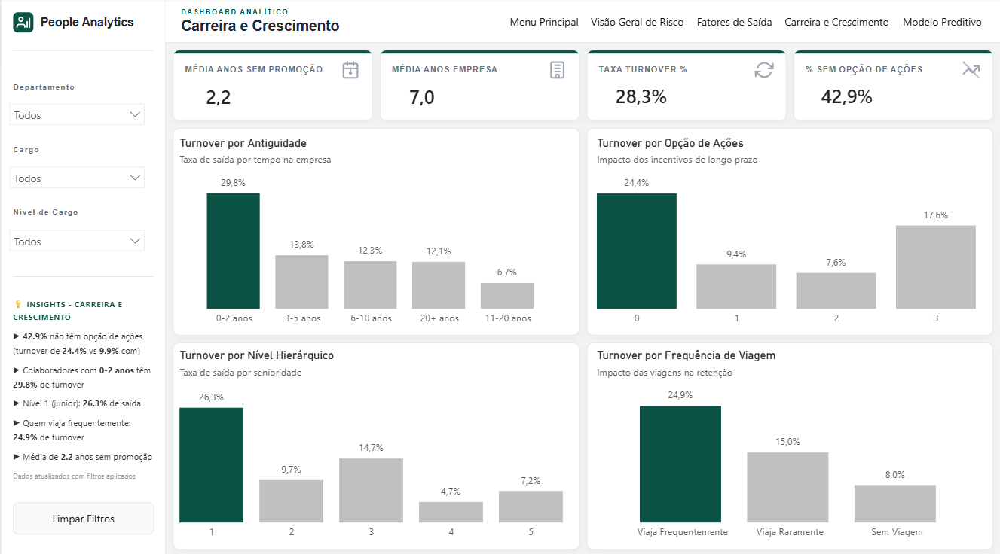

### 4. Modelo Preditivo

XGBoost + SMOTE + Optuna: métricas, importância das features e distribuição
por nível de risco.

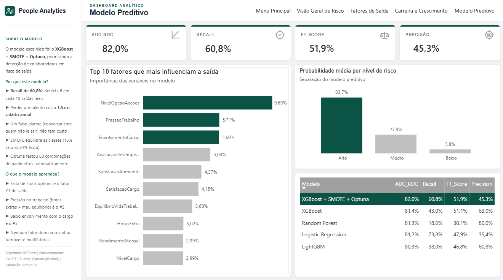

### Medidas DAX

O modelo contém medidas organizadas por pasta de visualização:

- **KPIs Gerais**: Total Colaboradores, Saídas, Taxa Turnover, Ficaram
- **Compensação**: Salário Médio (geral/saídas/ficaram), Gap Salarial, % Sem Opção de Ações
- **Satisfação**: Médias de ambiente, cargo, envolvimento, equilíbrio, relacionamento
- **Demografia**: Idade média, distância, anos empresa, anos sem promoção, % horas extra
- **Risco ML**: Alto/Médio/Baixo risco, % alto risco, risco médio, turnover real alto risco, custo estimado
- **KPIs Modelo**: AUC-ROC, Recall, F1 e Precision do modelo escolhido (tabela ml_comparacao_modelos)

### Tabelas de apoio ao ML

- **ml_comparacao_modelos**: métricas dos 5 modelos testados (alimenta a página Modelo Preditivo)
- **ml_feature_importance**: importância de cada feature (%)

## Como Executar

```bash
# Instalar dependências
pip install -r requirements.txt

cd scripts

# 1. Limpeza e preparação
python pipeline_limpeza_hr.py

# 2. Treino ML e scoring (demora ~2 min com Optuna)
python pipeline_ml_optimizado.py

# 3. Gerar gráficos (opcional)
python gerar_graficos.py
```

## Requisitos

```
python >= 3.9
pandas
numpy
pyarrow
scikit-learn
xgboost
lightgbm
shap
optuna
imbalanced-learn
matplotlib
seaborn
joblib
```

Versões exatas em `requirements.txt` (e `requirements-lock.txt` para reprodutibilidade).

## Resultados Chave

- Taxa de turnover: **16.1%** (237 de 1.470)
- Modelo detecta **61%** dos colaboradores que saem (recall)
- AUC-ROC do modelo escolhido: **0.819**
- 312 colaboradores classificados em alto risco (>= 40% de probabilidade)
- Custo estimado de turnover: salário médio x 1.5 x saídas
- Top fator: ausência de stock options

## Licença

Distribuído sob a licença MIT. Veja [LICENSE](LICENSE) para mais detalhes.
